# SpecAugment

This is a spectrum augmentation library for machine learning. All functions that support `AbstractArray` support **GPU** acceleration.

## Installation 💾

Installation of the registered version:

```julia
pkg> add SpecAugment
```

## Usage 📚

Supported features:

+ 💡 jittering (rand and randn noise)
+ 💡 rand gain and periodic sin shaped gain
+ 💡 flipping of amplitude
+ 💡 peak sliming and fatting
+ 💡 wrapping along time and frequency dimensions
+ 💡 stretching along time and frequency dimensions

In the following demonstrations, a double peak is used as an example of spectrum without time information.

```julia
f  = 0.0 : 2.0 : 4000.0;
p1 = @. 4exp( - (f - 1500)^2 / 35900 );  # center frequency is 1500Hz
p2 = @. 2exp( - (f - 2100)^2 / 99930 );  # center frequency is 2100Hz
p  = p1 + p2;
```

and a whistle signal would be used as an example of spectrum with time information.

```julia
using WAV, AcousticFeatures, SpecAugment, Plots

# A whistle example, but you can use your own sound file
data, fs = wavread("whistle.wav")
Fs = floor(Int, fs)

# An operator for calculating time-frequency spectrum
power = PowerSpec(fs = Fs, fmax=8000, winlen=1024, stride=128, nffts=2048, donorm=true, type=Vector{Float64});

# normlized in [0, 1] span as clean spectrum
X = minmaxnorms(10log10.(power(data) .+ 1e-5));
```

### Adding Noise 🎲

Add rand noise to input `x` along dimensions `dims`. The signal-to-noise ratio `snr` is in dB unit.

```julia
addrand(x::AbstractArray; dims=1, snr=10) -> y::AbstractArray
```

or add randn noise to input `x` along dimensions `dims`. The signal-to-noise ratio `snr` is in dB unit.

```julia
addrandn(x::AbstractArray; dims=1, snr=10) -> y::AbstractArray
```

let's apply them to spectrum without time information

<details>

```julia
prand = addrand(p, dims=1, snr=5);
prandn = addrandn(p, dims=1, snr=1);
plot(f, p, label="clean", fg_legend = :transparent, ylims=(-0.1, 5)); 
plot!(f, prand, label="5dB rand", framestyle=:zerolines); 
plot!(f, prandn, label="1dB randn", xlabel="frequency Hz")
```

</details>

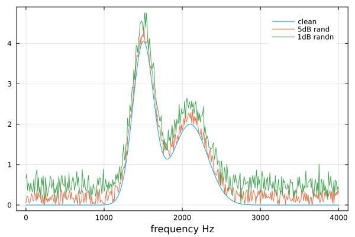

and to time-frequency spectrum

<details>

```julia
Xrand  = addrand(X, dims=(1,2), snr=-5);
Xrandn = addrandn(X, dims=(1,2), snr=-8);
heatmap(hcat(X, ones(1024,1), Xrand, ones(1024,1), Xrandn), ticks=nothing)
annotate!(125,     900, "clean",      :white)
annotate!(125+250, 900, "-5dB rand",  :white)
annotate!(125+500, 900, "-8dB randn", :white)
```

</details>

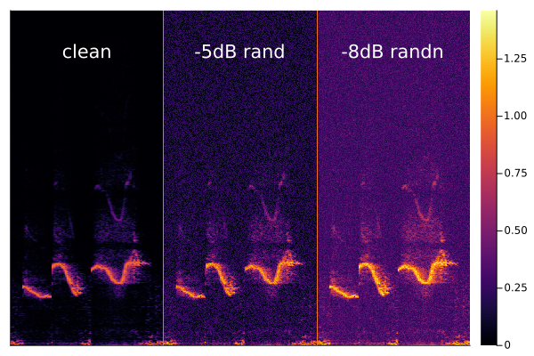

### Scaling 🎚️

Apply rand scale ∈ [`minscale`, `maxscale`] to `x` along dimensions `dims`.

```julia
randscale(x::AbstractArray{T},
          minscale::Real=0.9,
          maxscale::Real=1.1;
          dims::Union{Int,Dims}=1) where T <: Real
```

or apply sin scale ∈ [`minscale`, `maxscale`] to `x` along dimensions `dims`.

```julia
sinscale(x::AbstractArray,
         minscale::Real=0.9,
         maxscale::Real=1.1;
         dims::Union{Int,Dims}=1,
         phase::Real=0,
         cycles::Real=4)
```

let's apply them to spectrum without time information

<details>

```julia
prand = randscale(p, 0.8, 1.2, dims=1);
psin = sinscale(p, 0.7, 1.3, dims=1);
plot(f, p, label="clean", fg_legend = :transparent, ylims=(-0.1, 5)); 
plot!(f, prand, label="randscale", framestyle=:zerolines); 
plot!(f, psin, label="sinscale", xlabel="frequency Hz")
```

</details>

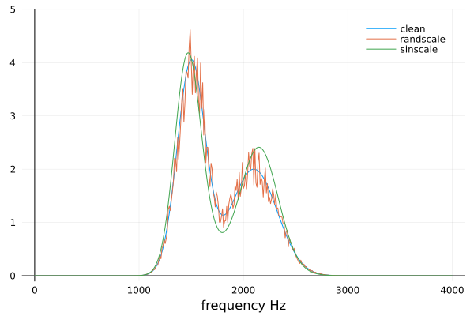

and to time-frequency spectrum

<details>

```julia
Xrand = randscale(X, 0.2, 1.5, dims=(1,2));
Xsin = sinscale(X, 0.3, 1.6, dims=(1,2));
heatmap(hcat(X, ones(1024,1), Xrand, ones(1024,1), Xsin), ticks=nothing)
annotate!(125,     900, "clean",      :white)
annotate!(125+250, 900, "randscale",  :white)
annotate!(125+500, 900, "sinscale",   :white)
```

</details>

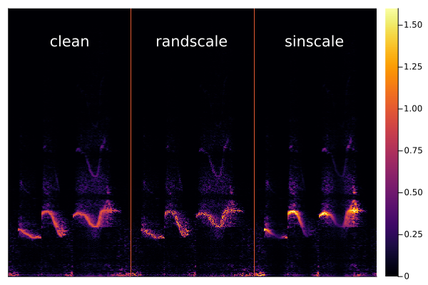

### Flipping 🤸

The input `x` and output `y` satisfies `y` = maximum(`x`; `dims`) .- `x`

```julia
flip(x::AbstractArray; dims::Union{Int,Dims}=1) -> y::AbstractArray
```

let's apply it to spectrum without time information

<details>

```julia
pflip = flip(p, dims=1);
plot(f, p, label="clean", fg_legend = :transparent, ylims=(-0.1, 5)); 
plot!(f, pflip, label="flipped", framestyle=:zerolines)
```

</details>

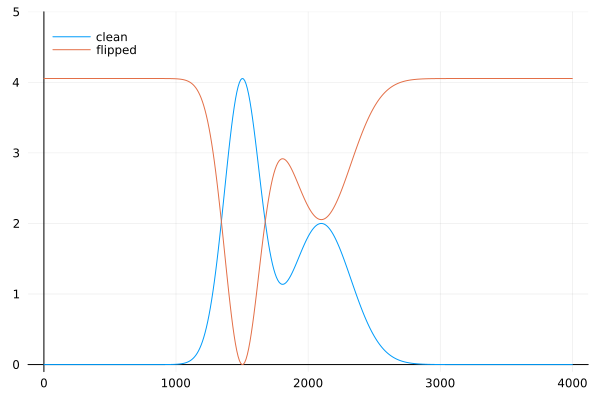

and to time-frequency spectrum

<details>

```julia
Xflip = flip(X, dims=(1,2));
heatmap(hcat(X, ones(1024,1), Xflip))
annotate!(125,     900, "clean",   :white)
annotate!(125+250, 900, "flipped", :black)
```

</details>

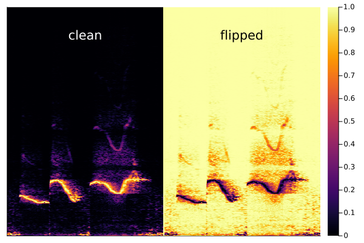

### Slimming and Fatting

Make the spectrum peak more `slim` or `fat` along dimension `dims`, the dB difference between `x` and the threshold `T` would be scaled by a positive `ratio`, that is

    [10log10(y) - 10log10(T) ] / [10log10(x) - 10log10(T)] = 1/ratio

where T = target * (xmax - xmin) + xmin,   xmax = maximum(`x`; `dims`),  xmin = minimum(`x`; `dims`)

if  `ratio` < 1,  the peak becomes thinner,
if  `ratio` > 1,  the peak becomes fatter.

```julia
slimorfat(x::AbstractArray{T};
          ratio::Real=2
          dims::Union{Int,Dims}=1,
          target::AbstractFloat=0.5) -> y::AbstractArray{T}
```

let's apply it to spectrum without time information

<details>

```julia
pslim = slimorfat(p, ratio=0.7);
pfatt = slimorfat(p, ratio=2);
plot(f, p, label="clean", fg_legend = :transparent, linewidth=2); 
plot!(f, pslim, label="slim", framestyle=:zerolines); 
plot!(f, pfatt, label="fat", xlabel="frequency Hz")
```

</details>

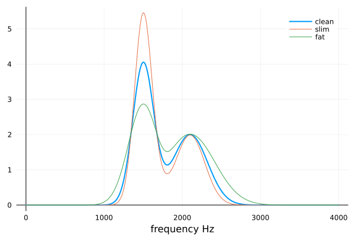

and to time-frequency spectrum

<details>

```julia
Xslim = slimorfat(X, dims=(1,2), ratio=0.8);
Xfatt = slimorfat(X, dims=(1,2), ratio=4);
heatmap(hcat(X, ones(1024,1), Xslim, ones(1024,1), Xfatt), ticks=nothing)
annotate!(125,     900, "clean", :white)
annotate!(125+250, 900, "slim",  :white)
annotate!(125+500, 900, "fat",   :white)
```

</details>

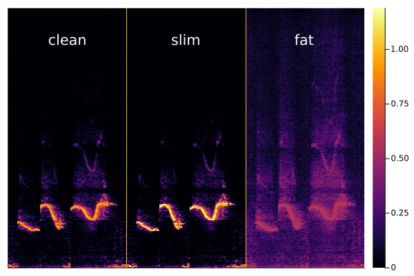

### Stretching (with some cropping ✂️) 🐛

Stretch `s` along dimension `dim` (along time or frequency). The stretching begins at `a∈[0,1]`, and ends at `b∈[0,1]`. If `a` < `b`, then stretch the proportional region [a,b] into [0,1]. If `a` > `b`, then stretch the proportional region [b,a] into [0,1] after flipping `s` along dimension `dim`.

```julia
stretch(s::AbstractArray{T},
        a::AbstractFloat=rand(0.02:0.02:0.1),
        b::AbstractFloat=rand(0.9:0.02:0.98); dim::Int=1) where T <: Real
```

let's apply it to spectrum without time information

<details>


```julia
pstretch1 = stretch(p, 0.2, 0.7, dim=1);
pstretch2 = stretch(p, 0.7, 0.2, dim=1);
plt1=plot(f, p, label="clean", fg_legend = :transparent); 
plot!(f, pstretch1, label="stretched", framestyle=:zerolines)
plt2=plot(f, p, label="clean", fg_legend = :transparent); 
plot!(f, pstretch2, label="stretched", framestyle=:zerolines)
plot(plt1, plt2, layout=(2,1))
```

</details>

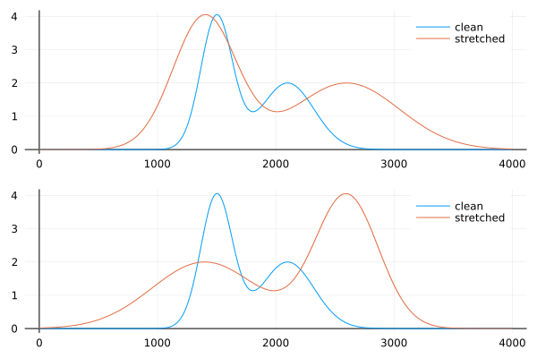

and to time-frequency spectrum at frequency dimension

<details>

```julia
Xstretch1 = stretch(X, 0.1, 0.6, dim=1);
Xstretch2 = stretch(X, 0.6, 0.1, dim=1);
heatmap(hcat(X, ones(1024,1), Xstretch1, ones(1024,1), Xstretch2), ticks=nothing)
annotate!(125,     900, "clean",     :white)
annotate!(125+250, 900, "stretched", :white)
annotate!(125+500, 200, "stretched", :white)
```

</details>

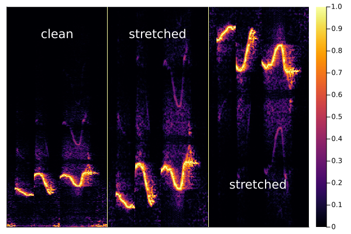

and to time-frequency spectrum at time dimension

<details>

```julia
Xstretch1 = stretch(X, 0.5, 0.9, dim=2);
Xstretch2 = stretch(X, 0.9, 0.5, dim=2);
heatmap(hcat(X, ones(1024,1), Xstretch1, ones(1024,1), Xstretch2), ticks=nothing)
annotate!(125,     900, "clean",     :white)
annotate!(125+250, 900, "stretched", :white)
annotate!(125+500, 900, "stretched", :white)
```

</details>

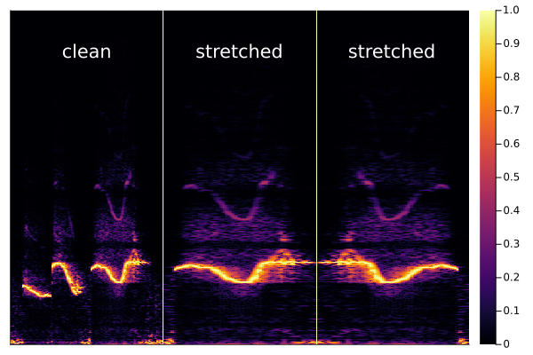

### Warpping towards Left or Right (Periodically) 🗺️

Warp the axis, while the starting and ending points of the axis remain the same.

<details>

```julia
begin
    oldids, newids = quadwarpmap(0.9, 2560);
    plt1 = plot(oldids, oldids, label="origin mapping");
    plot!(oldids, newids, label="quadwarp mapping")
    xlabel!("input indices");
    ylabel!("output indices")
    # --------------------------------------
    oldids, newids = sqrtwarpmap(0.3, 2560);
    plt2 = plot(oldids, oldids, label="origin mapping");
    plot!(oldids, newids, label="sqrtwarp mapping")
    xlabel!("input indices");
    ylabel!("output indices")
    # --------------------------------------
    oldids, newids = sinwarpmap(4, 0.7, 1024);
    plt3 = plot(oldids, oldids, label="origin mapping");
    plot!(oldids, newids, label="sinwarp mapping")
    xlabel!("input indices");
    ylabel!("output indices")
    # --------------------------------------
    oldids, newids = abssinwarpmap(3, 0.8, 2560);
    plt4 = plot(oldids, oldids, label="origin mapping");
    plot!(oldids, newids, label="abssinwarp mapping")
    xlabel!("input indices");
    ylabel!("output indices")
    # --------------------------------------
    plot(plt1, plt2, plt3, plt4, layout=(2,2),
         fg_legend = :transparent,
         bg_legend = :transparent)
end
```

</details>

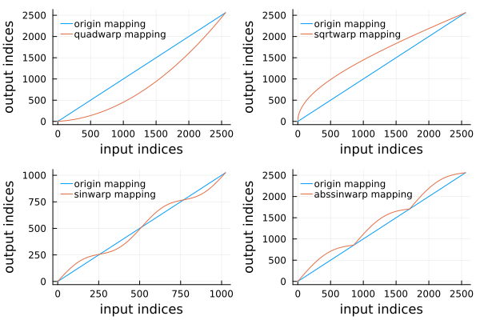

👇 Move peak to the left side by squared-quadratic warpping along dimension `dim `. 0 ≤ `a `≤ 1, if `a `==1, then peaks stand still, the closer the value of `a` is to 0, the more the peaks shift to the left. Test the effect via function `sqrtwarpmap`.

```julia
sqrtwarp(s::AbstractArray{T}, a::AbstractFloat=rand(T); dim::Int=1) where T <: Real
```

👇 Move peak to the right side by quadratic warpping along dimension `dim `. 0 ≤ `a `≤ 1, if `a `==0, then peaks stand still, the closer the value of `a `is to 1, the more the peaks shift to the right. Test the effect via function `quadwarpmap`.

```julia
quadwarp(s::AbstractArray{T}, a::AbstractFloat=rand(T); dim::Int=1) where T <: Real
```

👇 Perturbate peaks by sinusoidal warpping along dimension `dim`. The half-periodic number `k` > 0, bigger `k` causes less distortion of the peak. The amplitude of sine-wave's derivative `|a|` ≤ 1, larger `|a|` causes more distortion of the peak. Test the effect via function `sinwarpmap`.

```julia
sinwarp(s::AbstractArray{T}, k::Int=rand(20:5:50), a::AbstractFloat=rand(-1:0.2:1); dim::Int=1) where T <: Real
```

👇 Perturbate peaks by sinusoidal warpping along dimension `dim`. The half-periodic number `k` > 0, bigger `k` causes less distortion of the peak. The amplitude of sine-wave's derivative `|a|` ≤ 1, larger `|a|` causes more distortion of the peak. Test the effect via function `abssinwarpmap`.

```julia
abssinwarp(s::AbstractArray{T}, k::Int=rand(20:5:50), a::AbstractFloat=rand(-1:0.2:1); dim::Int=1) where T <: Real
```

let's apply them to spectrum without time information

<details>

```julia
psqrt = sqrtwarp(p, 0.7);
pquad = quadwarp(p, 0.7);
plt1 = plot(f, p, label="clean", fg_legend = :transparent, linewidth=2); 
plot!(f, psqrt, label="sqrtwarp", framestyle=:zerolines);
plot!(f, pquad, label="quadwarp", framestyle=:zerolines);
psin =    sinwarp(p, 30, 0.9);
pabs = abssinwarp(p, 8, 0.9);
plt2 = plot(f, p, label="clean", fg_legend = :transparent, linewidth=2); 
plot!(f, psin, label="sinwarp", framestyle=:zerolines);
plot!(f, pabs, label="abssinwarp", framestyle=:zerolines);
plot(plt1, plt2, layout=(2,1))
```

</details>

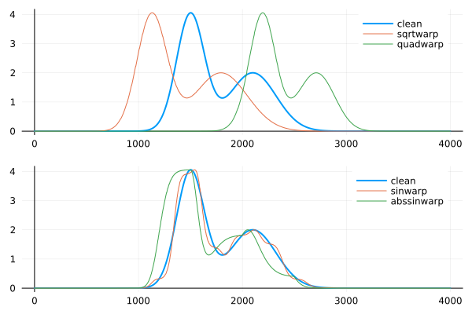

and to time-frequency spectrum at frequency dimension

<details>

```julia
Xsqrt = sqrtwarp(X, 0.6, dim=1);
Xquad = quadwarp(X, 0.6, dim=1);
plt1  = heatmap(hcat(X, ones(1024,1), Xsqrt, ones(1024,1), Xquad), ticks=nothing)
annotate!(125,     900, "clean", :white)
annotate!(125+250, 900, "sqrtwarp",  :white)
annotate!(125+500, 900, "quadwarp",   :white)
Xsin =    sinwarp(X, 2, 0.9, dim=1);
Xabs = abssinwarp(X, 2,-0.9, dim=1);
plt2 = heatmap(hcat(X, ones(1024,1), Xsin, ones(1024,1), Xabs), ticks=nothing)
annotate!(125,     900, "clean", :white)
annotate!(125+250, 900, "sinwarp",  :white)
annotate!(125+500, 900, "abssinwarp",   :white)
plot(plt1, plt2, layout=(2,1))
```

</details>

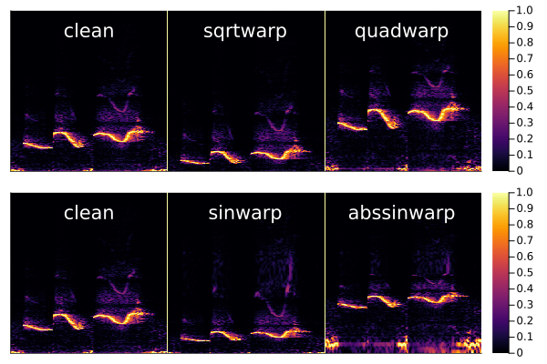

and to time-frequency spectrum at time dimension

<details>

```julia
Xsqrt = sqrtwarp(X, 0.6, dim=2);
Xquad = quadwarp(X, 0.6, dim=2);
plt1  = heatmap(hcat(X, ones(1024,1), Xsqrt, ones(1024,1), Xquad), ticks=nothing)
annotate!(125,     900, "clean", :white)
annotate!(125+250, 900, "sqrtwarp",  :white)
annotate!(125+500, 900, "quadwarp",   :white)
Xsin =    sinwarp(X, 2, 0.9, dim=2);
Xabs = abssinwarp(X, 2,-0.9, dim=2);
plt2 = heatmap(hcat(X, ones(1024,1), Xsin, ones(1024,1), Xabs), ticks=nothing)
annotate!(125,     900, "clean", :white)
annotate!(125+250, 900, "sinwarp",  :white)
annotate!(125+500, 900, "abssinwarp",   :white)
plot(plt1, plt2, layout=(2,1))
```

</details>

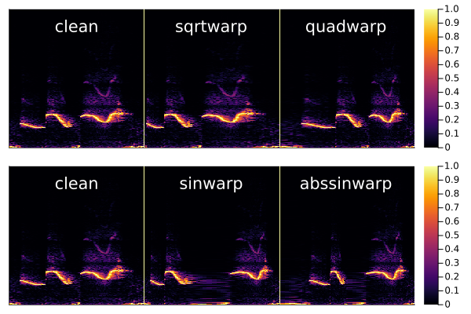
